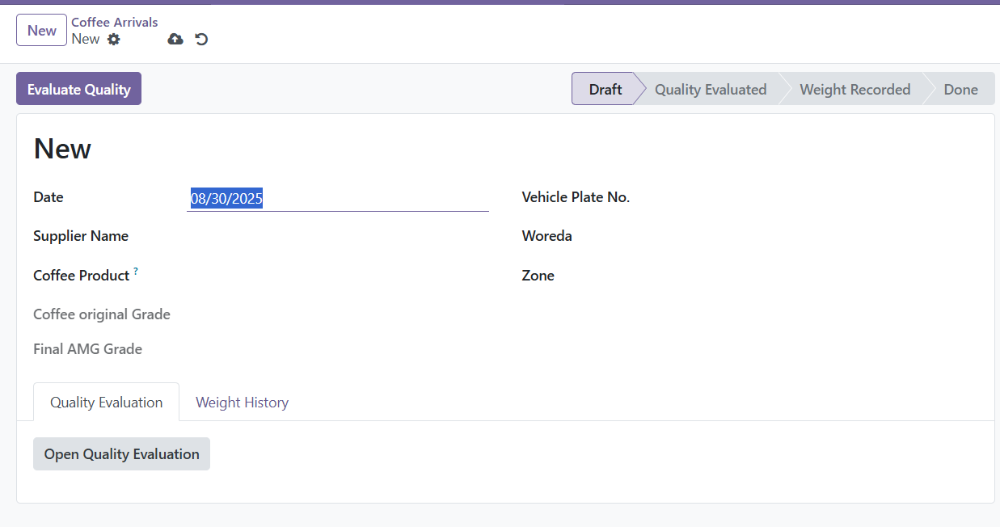
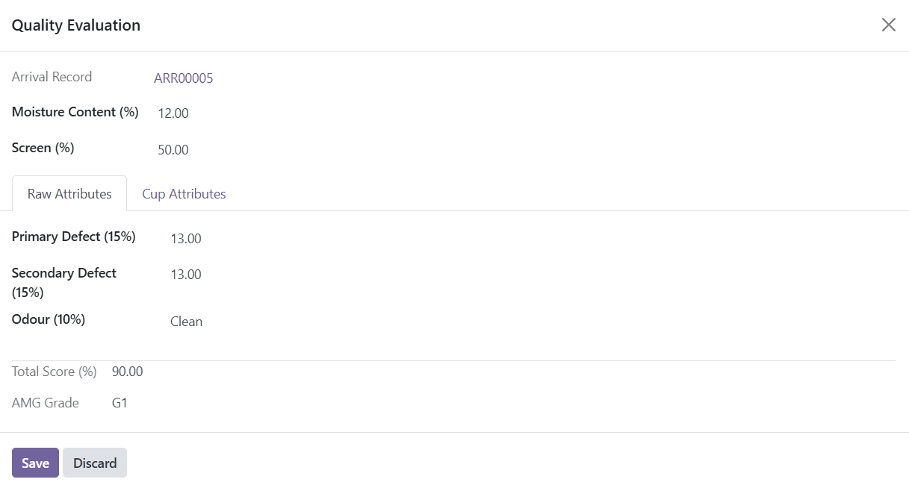
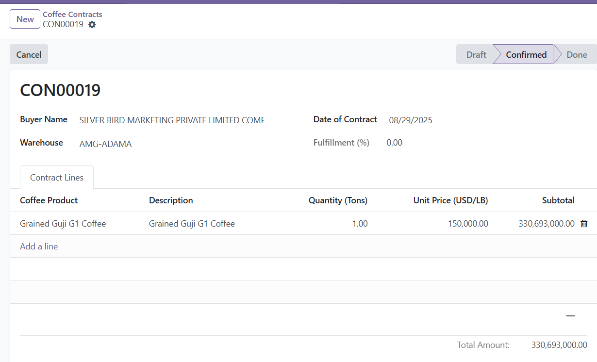

#  Coffee Management System

The Complete ERP Solution for the Coffee Supply Chain

            Features
            Workflow
            Reporting
            Screenshots
            Configuration

## A Specialized Workflow for a Specialized Industry

### Dynamic Product Creation

Automatically creates new, distinctly graded product variants based on quality control results. This ensures your inventory is always tracked by its true, evaluated grade, not a generic name.

### Direct Manufacturing Control

Confirming a sales contract instantly creates both the Delivery Order and the corresponding Manufacturing Order, giving you explicit, manual control over your production pipeline and bypassing complex automation rules.

### Specialized Procurement

A unique multi-step process for handling coffee arrivals, from quality to weight to final stock reception, capturing far more detail than the standard purchase workflow.

### Intelligent Component Checking

Before confirming a Manufacturing Order, the system automatically checks for component availability and creates a warning activity for planners if there are shortages, preventing production delays.

### Granular Data Classification

Leverage custom models for Coffee Type, Origin, ECX Grade, Zones, and Woredas to build a highly structured, filterable, and accurate database of your coffee products.

### Full ERP Integration

Seamlessly integrated with Odoo's core Inventory, Manufacturing, and Accounting applications, ensuring all operations are fully traceable and auditable.

## Unique Business Workflows

### Inbound: From Arrival to Graded Stock

1. **Coffee Arrival:** The process begins when a delivery arrives. A user creates an Arrival record, capturing supplier, vehicle, and initial coffee details from pre-configured ECX classifications.
2. **Quality Evaluation:** An expert performs a detailed quality assessment. Upon saving, the system calculates a final AMG Grade.
3. **Dynamic Product Assignment:** The system automatically searches for a product matching the Origin, Type, and final AMG Grade. If one doesn't exist, a new product is created on the fly and linked to the arrival.
4. **Weight Recording:** The precise weight of the batch is recorded and logged for auditing.
5. **Stock Receiving:** A Goods Receiving Note (GRN) is created. Confirming the GRN creates and validates an Odoo inventory transfer, moving the specific, newly-graded product into a warehouse location.

### Outbound: From Contract to Production

1. **Create Coffee Contract:** A user creates a sales contract, adding finished goods to the contract lines.
2. **Confirm Contract:** A single click on "Confirm" executes a powerful custom logic.
3. **Automated Creation:** The system instantly creates a Delivery Order and, for each relevant product line, manually creates a Manufacturing Order, linking them all back to the source contract for full traceability.
4. **Check Availability:** If raw material components are unavailable, the Manufacturing Order is created in "Draft" and an activity is scheduled to alert planners, preventing production holds.

## Advanced Reporting Suite

The module includes a comprehensive reporting suite to provide insights into every corner of your coffee operations.

### Wizard-based PDF Reports

A custom wizard allows users to generate detailed, professional PDF reports for a selected date range. These are perfect for formal documentation, meetings, and audits.

- **Arrival & Quality Report:** Summarizes all incoming batches with their final quality scores and grades.
- **Warehouse Stock Report:** A stock movement report showing beginning balance, receipts, issues, and ending balance for coffee products.
- **Contract Fulfillment Report:** Tracks the progress and financial value of all confirmed sales contracts.
- **Manufacturing Report:** Provides an overview of all production orders, their status, and their link to sales contracts.

### Analytical Dashboards

A dedicated "Analytics & Reports" menu provides pivot tables and graph views for real-time analysis, allowing you to slice and dice your data interactively.

- Analyze arrivals by supplier, grade, or date.
- View quality evaluation scores across different origins.
- Track contract fulfillment and value by customer.

## Screenshots

Detailed Coffee Arrival Form

In-depth Quality Evaluation

Streamlined Coffee Contract

Powerful Analytics and Reporting

## Setup & Configuration

To ensure seamless operation, a one-time configuration of your master data is required.

1. **Install Dependencies:** From the manifest, ensure `stock`, `mrp`, `purchase`, `sale`, `product`, `contacts`, `account`, and `mail` apps are installed.
2. **Configure Classifications:** Navigate to `Coffee Management > Configuration` and populate your master data for `Coffee Types`, `Coffee Origins`, `ECX Coffee Grades`, `Zones`, and `Woredas`.
3. **Define ECX Products:** In `Configuration > ECX Coffee Products`, create the base combinations of Origin, Type, and Grade. These are used as templates for the dynamic product creation during the arrival process.
4. **Configure Finished Goods & BoMs:** For any coffee product you intend to manufacture (e.g., "Roasted Guji G1 Coffee"), you must manually create it as a `Storable Product` and define a Bill of Materials (BoM) for it.

© 2025 AMG Enterprise Application Development Team. A Specialized Solution for the Coffee Industry.